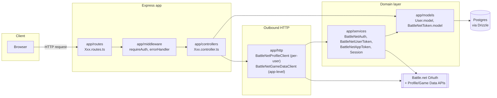

# Architecture Overview

Layering of the codebase per [CLAUDE.md](../CLAUDE.md)'s directory conventions, and how a request moves through it. `app/http/` clients are the only sanctioned way to call Battle.net — no other layer manages tokens or calls Battle.net directly.

## Flow docs

- [Battle.net login (OAuth authorization code)](flows/battlenet-login.md)
- [Authenticated WoW profile request, with token refresh](flows/wow-profile-request.md)
- [`getValidAccessToken` decision logic](flows/token-refresh-decision.md)
- [Game Data API app-level client credentials token](flows/game-data-app-token.md)
