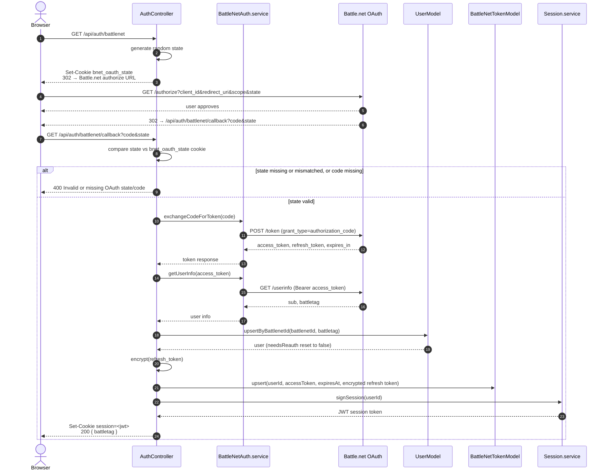

# Battle.net Login (OAuth Authorization Code)

Covers `GET /api/auth/battlenet` → `GET /api/auth/battlenet/callback`. See [battlenet-oauth-integration.md](../../plans/prds/battlenet-oauth-integration.md) for the full spec.

- State is a random value stored in a short-lived, `httpOnly` cookie (`bnet_oauth_state`) and echoed back by Battle.net; the callback rejects the request if it's missing or doesn't match, preventing CSRF on the callback.
- The refresh token (if Battle.net returns one) is AES-256-GCM encrypted (`Crypto.util.ts`) before being persisted — it's never stored in plaintext.
- `upsertByBattlenetId` both creates new users and clears `needsReauth` on returning users who complete a fresh login.

