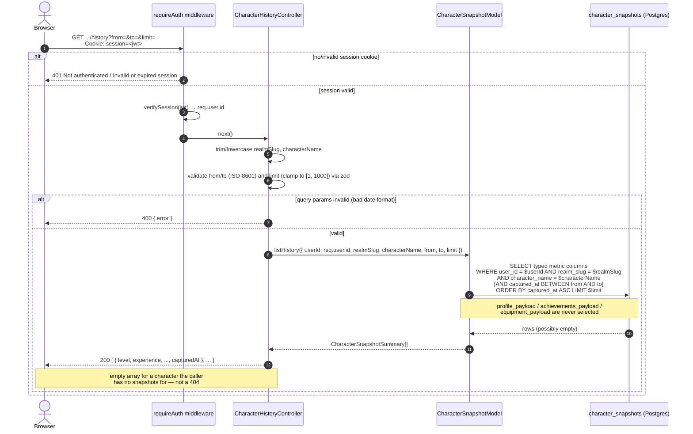

# Character Snapshot History Query

Covers `GET /api/profile/wow/character/:realmSlug/:characterName/history` and `GET .../history/latest`. See [character-history-query.md](../plans/prds/character-history-query.md).

Unlike every other diagram in this directory, this flow never touches Battle.net — it's a pure database read against `character_snapshots`, the table the scheduled snapshot job (see the Scheduled character snapshots section in the README) has been writing to. The only client-supplied identity check is the session cookie; there's no live armory call to fail or retry.

The key contrast with the live `/api/profile/wow/character/*` passthrough endpoints (`docs/flows/wow-profile-request.md`'s sibling flows) is **ownership scoping**: those endpoints accept any realm/character-name pair from any authenticated caller, because the underlying Battle.net data is public. History is different — it's data the app collected on a specific user's behalf, so every query is additionally filtered by `character_snapshots.user_id`, regardless of whether the character is still on the caller's tracked list.

### `.../history/latest`

Same auth/ownership scoping, but `Model.findLatest({ userId, realmSlug, characterName })` orders descending by `captured_at` and takes one row. If no row matches, the controller returns `404 { error: 'No snapshot found' }` instead of an empty body — the one place this flow's response shape diverges from `history`'s "always 200" behavior, since "no snapshot exists yet" is a meaningful distinction for a single-record lookup in a way it isn't for a list.
