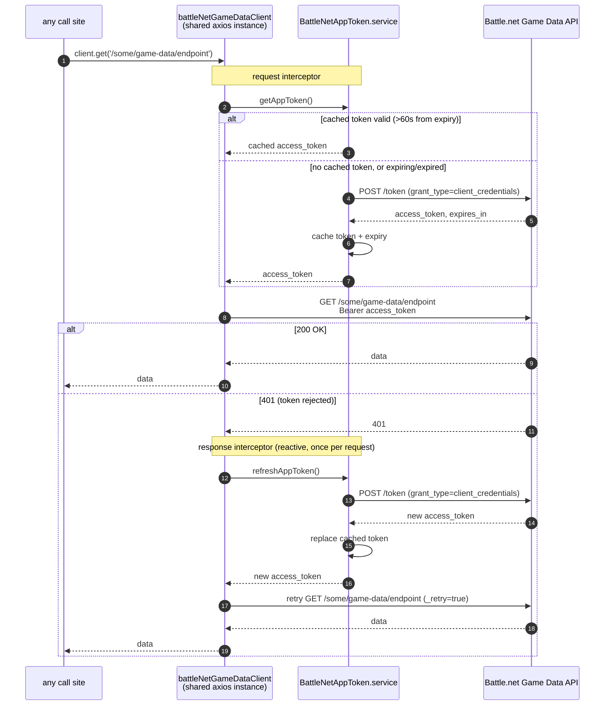

# Game Data API — App-Level Client Credentials Token

Covers `battleNetGameDataClient` (`app/http/BattleNetGameDataClient.ts`), the shared axios instance for Battle.net's **Game Data API** (static reference data — item/spell/talent lookups, etc., not tied to any one player). No route currently calls this client; it exists as sanctioned infrastructure for when game-data endpoints are added.

Unlike the per-user Profile API flow, this uses OAuth **Client Credentials** grant — a single app-wide token, cached in memory (module-level `cachedToken`) and shared across all requests/users, not stored per-user in the database.

