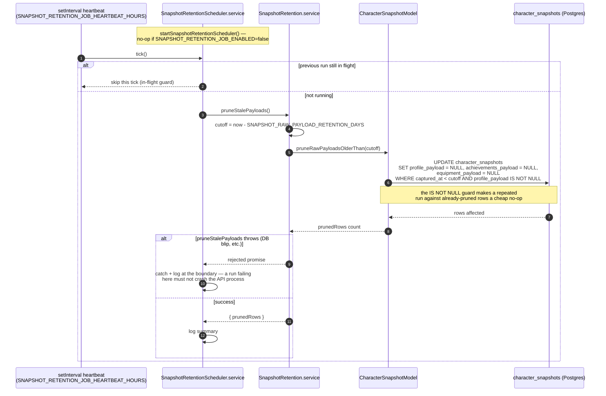

# Raw Payload Retention (Pruning Job)

Covers `startSnapshotRetentionScheduler()` / `SnapshotRetention.service.pruneStalePayloads()` and the `npm run job:prune-snapshots` CLI entrypoint. See [character-history-query.md](../plans/prds/character-history-query.md).

Same shape as the scheduled snapshot-polling job (no diagram for that one yet, but see the "Scheduled character snapshots" section of the README for its behavior), with one important difference in intent: this job never calls Battle.net. It only trims local data, which is why it's enabled by default while the polling job is not.

### Manual run (`npm run job:prune-snapshots`)

`scripts/run-snapshot-retention-job.ts` calls `connect()`, then `pruneStalePayloads()` directly (bypassing the scheduler entirely — no in-flight guard needed for a single one-shot invocation), logs `{ prunedRows }`, and exits `0`, or logs the error and exits `1`. It runs regardless of `SNAPSHOT_RETENTION_JOB_ENABLED`, mirroring `npm run job:snapshot`'s relationship to `SNAPSHOT_JOB_ENABLED`.
