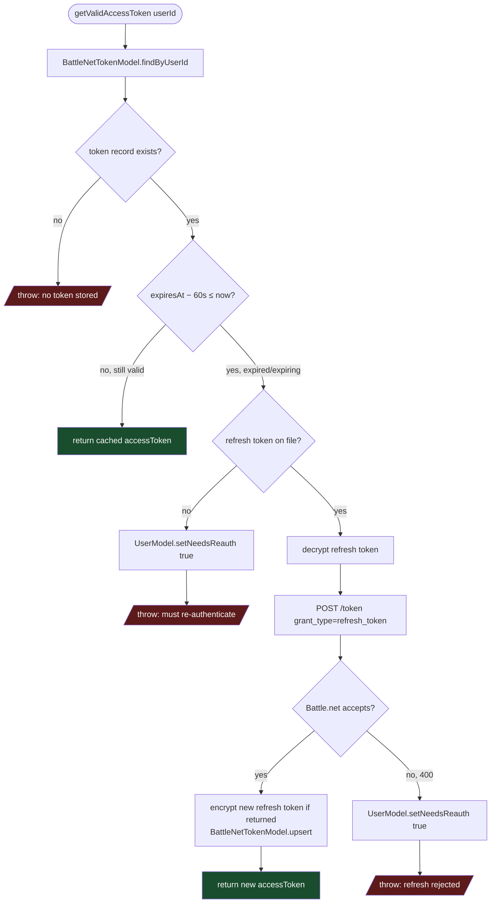

# `getValidAccessToken` Decision Logic

The decision tree inside `BattleNetUserToken.service.ts` that every per-user Battle.net API call goes through before a request is made (see [wow-profile-request.md](wow-profile-request.md) for it in context). `forceRefreshAccessToken` follows the same refresh/persist/`needsReauth` logic but skips the expiry check — it's invoked directly after Blizzard has already returned a `401`.

Downstream, controllers that catch a rejected Battle.net call (e.g. `ProfileController.wow`) re-check `UserModel.findById(userId).needsReauth` to decide between surfacing `401 { error: "needs_reauth" }` and letting an unexpected error propagate to the centralized error handler.
