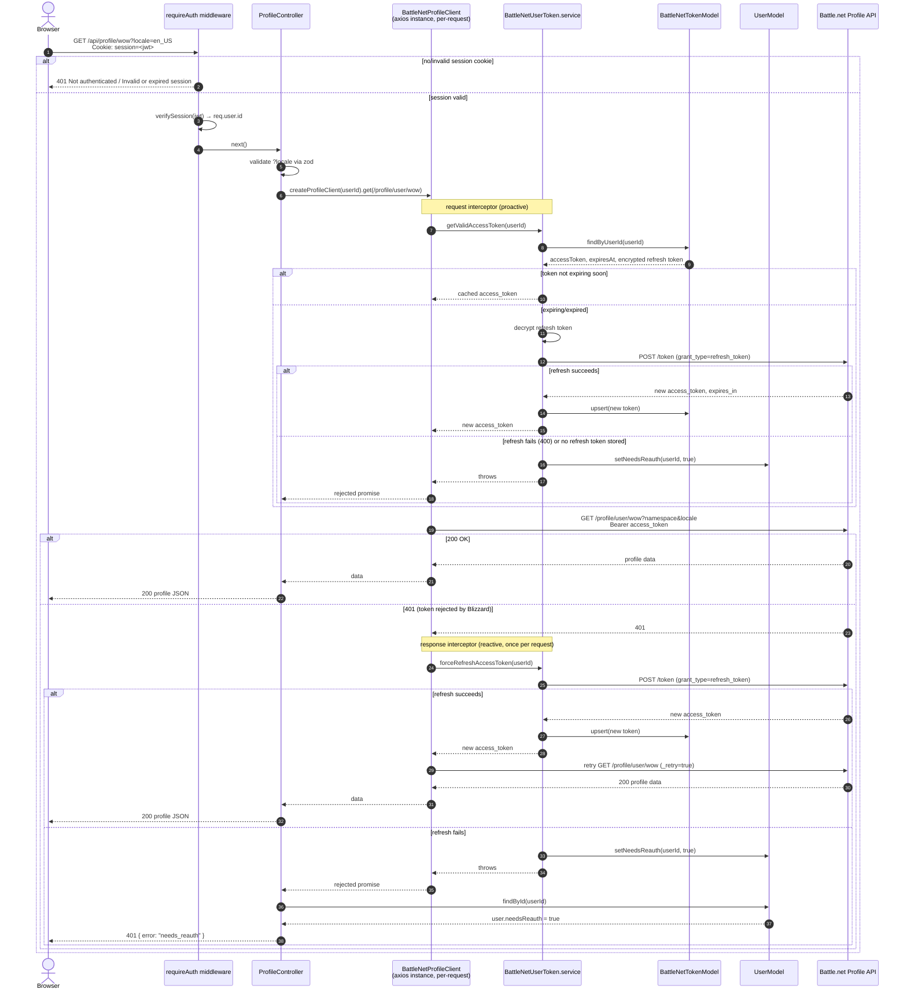

# Authenticated WoW Profile Request (with token refresh)

Covers `GET /api/profile/wow`. See [wow-profile-summary.md](../../plans/prds/wow-profile-summary.md).

Two independent refresh paths exist and both are shown here:

1. **Proactive/lazy** — `getValidAccessToken`, called from a request interceptor on every call, refreshes if the stored token is within `EXPIRY_SAFETY_MARGIN_MS` (60s) of expiring.
2. **Reactive** — if Battle.net still returns `401` (e.g. token revoked early), a response interceptor calls `forceRefreshAccessToken` once and retries the original request (`_retry` flag prevents infinite loops).

If a refresh fails because Blizzard rejects the refresh token (`400`), or no refresh token is on file, `UserModel.needsReauth` is set to `true`; the controller checks this flag to return `401 { error: "needs_reauth" }` instead of a generic `500`.

